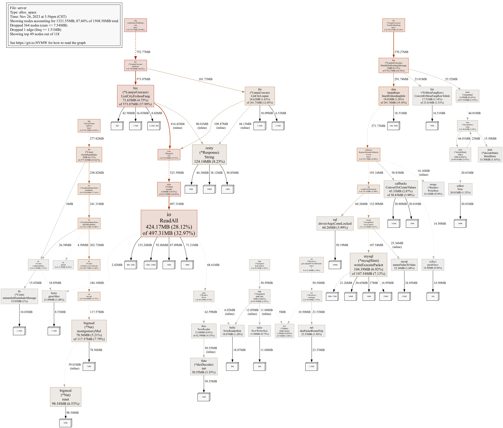
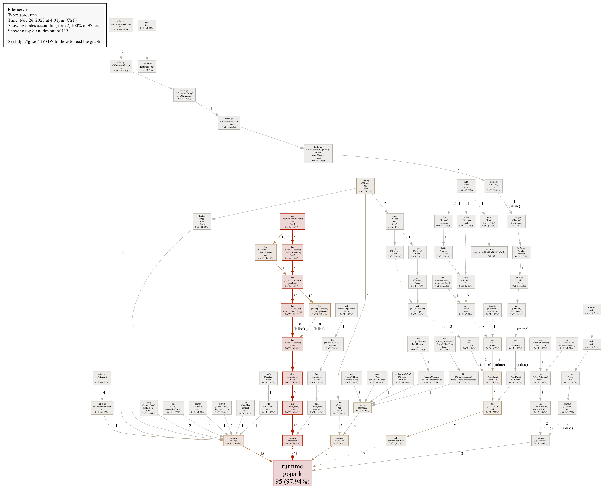
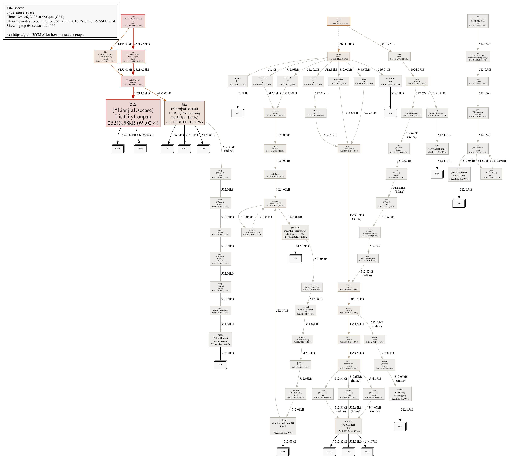

# Performance Analysis
This document describes the performance analysis of the project using pprof.

## Allocs profile
```shell
go tool pprof http://localhost:8000/debug/pprof/allocs
```


## Goroutine profile
```shell
go tool pprof http://localhost:8000/debug/pprof/goroutine
```


## Heap profile
```shell
go tool pprof http://localhost:8000/debug/pprof/heap
```
